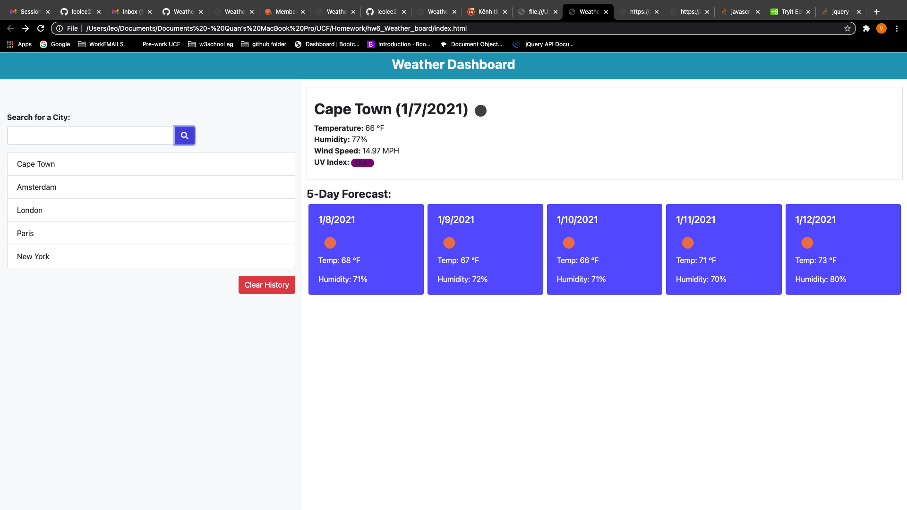
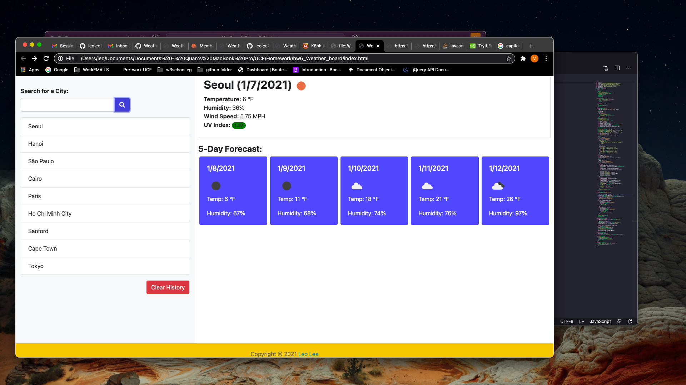

# hw6_Weather_board
Created a functional weather dashboard using API from openweather.com (AJAX methods).Use the [OpenWeather API](https://openweathermap.org/api) to retrieve weather data for cities.
Use `localStorage` to store any persistent data.
Users can save up to 9 of their searched locations and can access their searched locations by clicking on the city names. Also users have option to erase the searched history.Also created UVI color badge for anyone with skin disease (cancer): ranges similar to traffic lights from green -yellow -orange -red- red purple.
Some demos for my application:

Deployed Link:
https://leolee2708.github.io/hw6_weather_dashboard